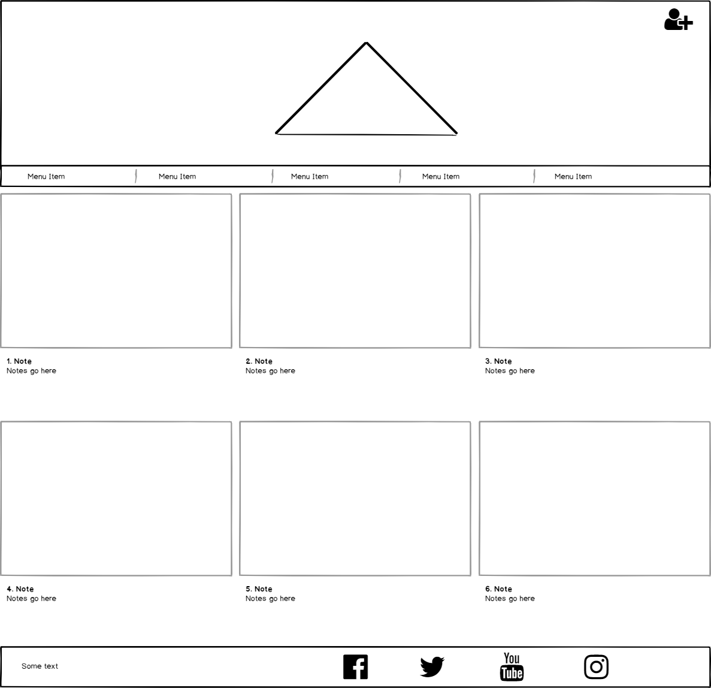
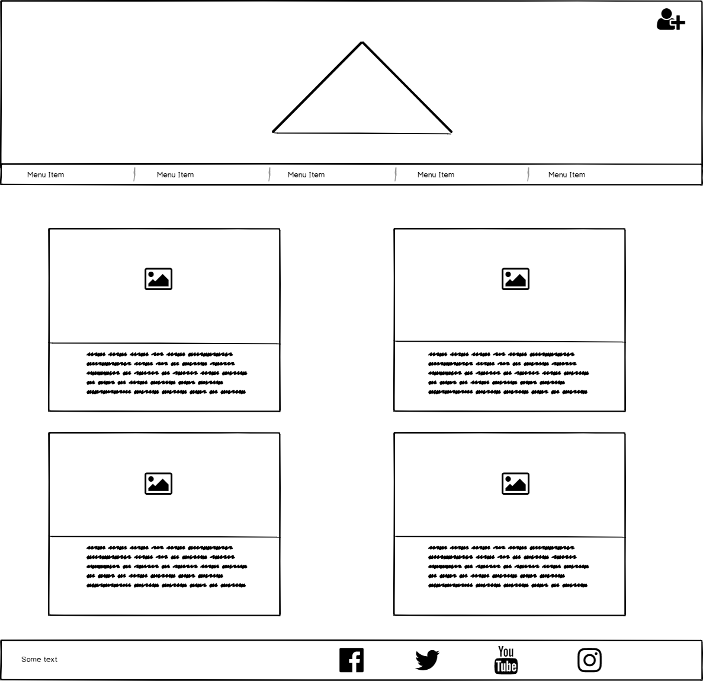
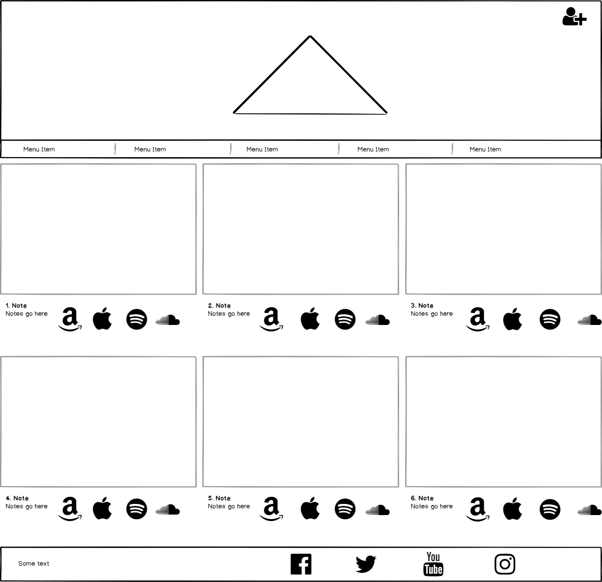
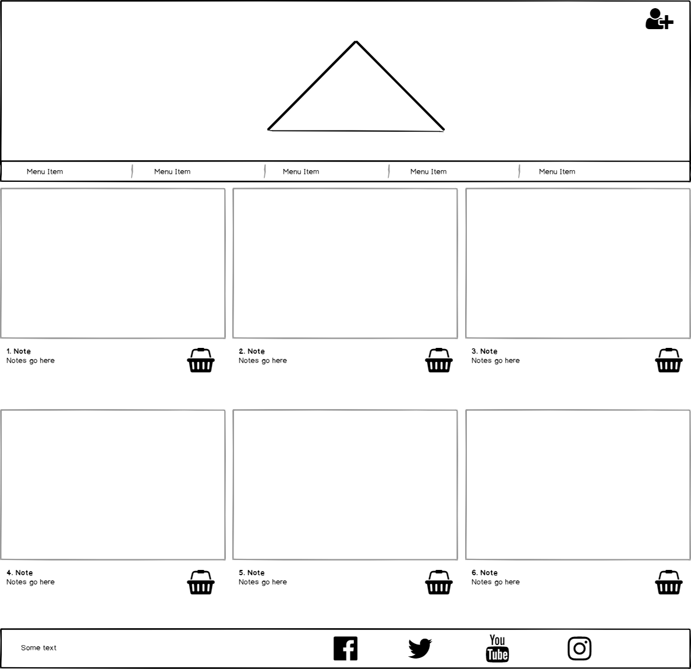
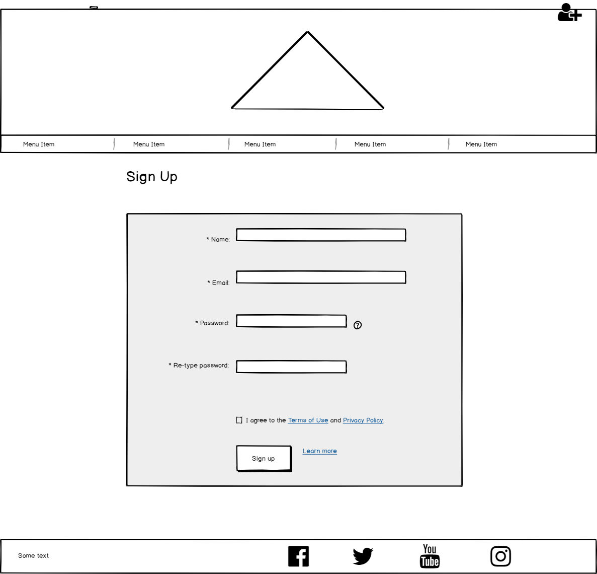
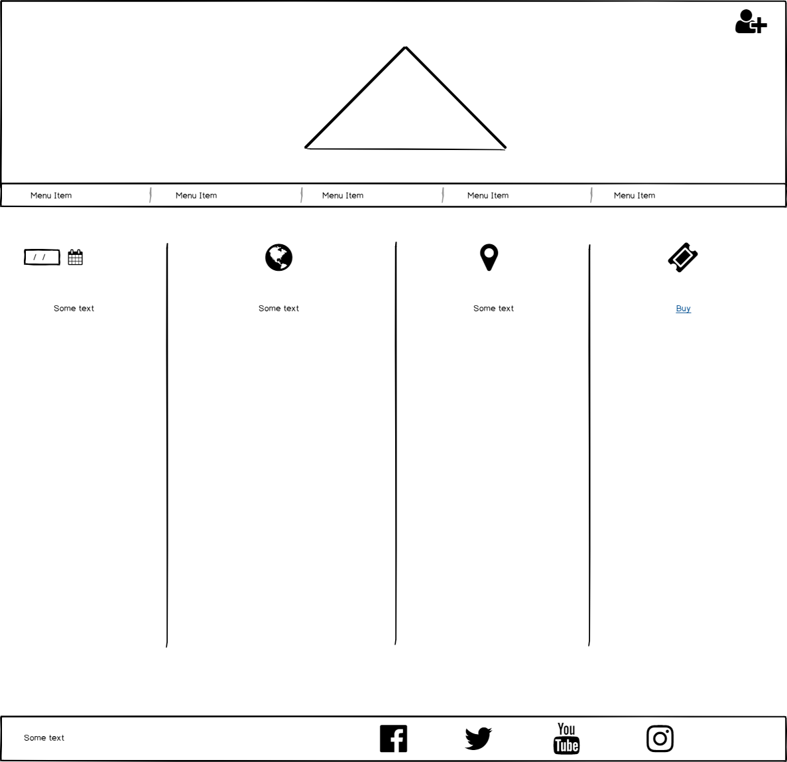

# PINK FLOYD WEBSITE

This is the official website for Pink Floyd. It is designed to be responsive and accessible on a range of devices to a large audience. It should be engaging and easy to explore and navigate through

## UX

* User Goals

    * New Users - 
        1. I want to learn about the band and discover their music. I would like to hear their music and see a video of them playing, 
        it should be easy for me to navigate the site and find out about this information.
        3. I would like to be able to buy the bands music and want to know where I can get it.
        4. I should be able to follow Pink Floyds official social media channels to keep up to date with any new releases and tour information 
       
    * Regular Users - 
        1. I want to know more about the individual band members. I would like to follow their social media channels and get to know more about them as people.
        2. I want to be able to sign up to a newsletter so that I can stay in touch with what the band is doing and get to learn about any future releases / touring information.
        3. I would also like to be able to see any official merchandise the band has and be able to purchase it. 
            
* Design

    * The site will contain classic colouring and imagery of the iconic dark side of the moon and the wall album cover's.
    * I have chosen a solid modern "Rubik" font from goole fonts that compliments the textual styling of some of Pink Floyd's albums. "The Wall" font styling would not be suitable. Sans-serif is in back up if Rubik does not work.
    * I have used imagery across the site that is well known not only to Pink Floyd fans but people beyond that. Dark side of the moon and the wall are iconic and will bring some familiarity to the site. This imagery also brings a level of trust to the user.
        * Familiar logo's, pictures of the band (old and new) and official merchandise are also displayed regularly.
        
* Wireframes

    * Home page wire frame 
    

    
    

    * Band wire frame
    
 
    
    

    * Music wire frame
    
 
    
    

    * Shop wire frame 
    

    
    

    * Sign up wire frame 
    

    
    

    * Tours wire frame 
    

    
    
    

* Featured coding languages and Tools Used
    
    *HTML5
    *CSS
    * <a href="https://www.bootstrapcdn.com/">Bootstrap 4.2.1</a> - for styling and resposive grid settings
    * <a href="https://www.bootstrapcdn.com/fontawesome/">Font awesome 4.7.0</a> - for social icons such as FB, twitter etc
    * <a href="https://fonts.google.com/">Google Fonts</a> - used to import Rubik and Lato although Lato was never used
    * <a href="https://github.com/">Github</a> - used to push commits to for safe storing
    * <a href="https://gitpod.io/workspaces/">Gitpod</a> - used to create and commit to git before pushing to github
    * <a href="https://balsamiq.cloud/spaces">Balsamiq</a> - used to create wireframes

## TESTING
    
* The W3C Markup Validator and W3C CSS Validator Services were used to validate every page of the project to ensure there were no syntax errors in the project.

    1. W3C Markup Validator for HTML and CSS - <a href="https://github.com/DJWOOLLEY84/Milestone-Project-1/blob/3e0416ee7dda546269048bfb5381be2309fad3af/assets/Wireframes">Results</a> 

* Testing User Goals

    * New Users - 
        1. You are greeted by a colourful navigation bar which is clearly labelled with additional icons for easy navigation. A story board area is the main feature 
        of the page with links to click to see, the band, the music etc. The hero banner is an immediate indication that i am in the right place.
        2. The band's music page shows 6 of their biggest albums with apple and amazon icons for people to click to purchase the music. Additional indicators are above these
        icons to bring it to their attention
        3. The bands offical social media channels are found in the footer on all pages of the website. Hover.css is used on these to let people know they can click on them. 
        Hover.css goes throug all the colours of the dark side of the moon album cover rainbow to compliment the cover and navigation bar.
        
    * Regular Users - 
        1. A band members page has been created to show members of the band as they are now. Each band member also has a famous quote of theirs attributed to them and if they 
        have any social media channels they are provided below the text. These also use hover.css in the same way.
        2. A sign-up page has been created so that people can sign up to the mailing list for all the latest news from Pink Floyd.
        3. A shop page has been created to show _some_ of the pink floyd merchandise available. Prompts are given to buy from the new web-store (another web-site) with another
        prompt at the bottom of the page to let people know there is more available from there.
        4. All cta buttons on each separate page of the side are colour coded to match the navigation bar. I.E the tours page "BUY NOW" button is colour coded #009BBE blue to 
        the colour assigned to the page from the navigation bar which came from the dark side of the moon album cover. 

* Testing screen sizes and browsers
    * The site was tested through google, firefox and microsoft edge on two lap tops of differing sizes. An iphone 7,8 and X have been used to show how the site visualizes on 
    phones.
    * There was one possible bug found. In firefox, upon inspection at phone view it showed the table on the tours page as being unable to shrink to the size of the screen. A 
    cursor bar was provided to move the table left from right. However, when viewed on the apple phones I have tested this has not been the case.

## Deployment

* The project was deployed to GitHub Pages using the following steps...
    1. Log in to GitHub and locate the GitHub Repository
    2. Find the "Settings" Button on the menu at the top of the Repository.
    3. Scroll down the Settings page until you locate the "GitHub Pages" Section.
    4. Under "Source", click the dropdown called "None" and select "Master Branch".
    5. The page will automatically refresh.
    6. Scroll back down through the page to locate the now published site link in the "GitHub Pages" section.

### Forking the GitHub Repository

* By forking the GitHub Repository we make a copy of the original repository on our GitHub account to view and/or make changes without affecting the original repository by using the following steps...
    1. Log in to GitHub and locate the GitHub Repository
    2. At the top of the Repository (not top of page) just above the "Settings" Button on the menu, locate the "Fork" Button.
    3. You should now have a copy of the original repository in your GitHub account.

* Making a Local Clone
    1. Log in to GitHub and locate the GitHub Repository
    2. Under the repository name, click "Clone or download".
    3. To clone the repository using HTTPS, under "Clone with HTTPS", copy the link.
    4. Open Git Bash
    5. Change the current working directory to the location where you want the cloned directory to be made.
    6. Type git clone, and then paste the URL you copied in Step 3.

    $ git clone https://github.com/YOUR-USERNAME/YOUR-REPOSITORY

    7. Press Enter. Your local clone will be created.

## Credits

* I had to resize the YouTube iframe because it was not resposive. Not being able to use Javascript, to do this I used some code from (with the guidance of my mentor, Gerry) a 
<a href="https://stackoverflow.com/questions/7737557/how-can-i-make-the-youtube-player-scale-to-the-width-of-the-page-but-also-keep-t">Stack Overflow</a> post. The HTML Validator
also highlighted that the soundcloud iframe's were not written as they should be and that they featured "frameborder" and "scrolling" that were now obsolete. I removed these from
the iframe which then left a border. I used the same code used from the Youtube code as the basis of getting rid of this border. 

* I used what I had learnt from the resume project to build my navigation bar. Once the idea of doing a band was presented in the introductory milestone project notes, i immediately 
thought of creating the navigation bar in the same way so that i could play with the colours of the pink floyd album cover through the site.

* I used google dev tools heavily to get the sign-up jumbotron to align properly on all screens. I had to play about with it in phone view to get the right "display" field to make it 
align properly. 

* I used the <a href="https://www.bootstrapcdn.com/">Bootstrap</a> library a lot for guidance on grid settings, using offsets properly for the home page and buttons. 

* I also had to google how to fade colours in and out (for the band and music pages) - this led me too a page on linear gradients on 
<a href="https://www.w3schools.com/css/css3_gradients.asp">w3schools</a> where i saw code written and learnt how to use gradients, particularly linear gradients.

